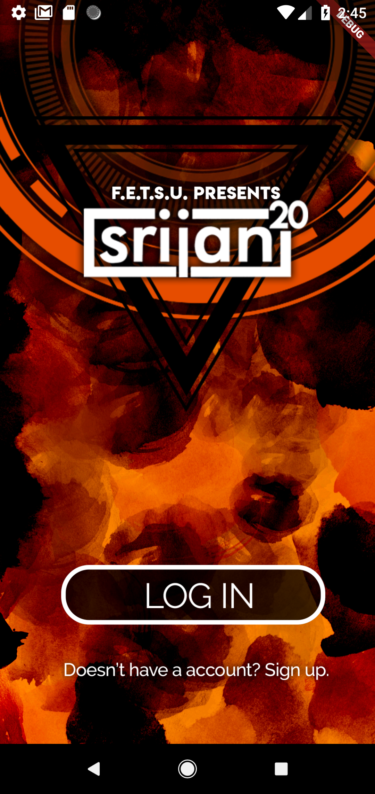
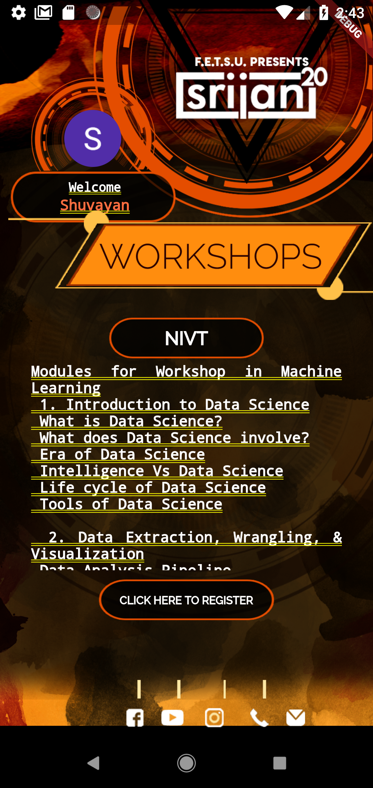

# srijan_app

An app made for the tech fest of Jadavpur University


## Testing the app locally:

* Git clone the repository
* On the required folder open up a terminal ,
* Open up an emulator of your choice
* in the terminal add the command
```
$ flutter run
```

The app should run on the terminal


## Scope of improvement

* The app is not responsive to all screen sized yet.
* Anything more that the user suggests


## App Screenshots



